# Sơ Đồ ERD Level 2 --- Hệ Thống Đặt Hàng Qua Nút Bấm IoT (Đa Cửa Hàng) [Phiên Bản 2.1 - Cố Định Cửa Hàng Cho Nút]

## 1. Phạm vi mô hình (Scope)

Mô hình ERD này mô tả chi tiết các thực thể dữ liệu, thuộc tính và mối quan hệ cho nền tảng đặt hàng qua Nút bấm IoT đa cửa hàng.

### Các nguyên tắc kiến trúc cốt lõi:
- Hỗ trợ nhiều Cửa hàng (`STORE`) độc lập trên cùng một hệ thống.
- Khách hàng có 1 tài khoản toàn cầu (`CUSTOMER_PROFILE`), có thể sở hữu nhiều Nút bấm thuộc các Cửa hàng khác nhau.
- **Một Nút bấm (`IOT_BUTTON`) gắn liền cố định với DUY NHẤT 1 Cửa hàng từ lúc tạo và không chuyển đổi Cửa hàng**.
- Mã thiết bị (`device_id`) và mã hiển thị (`button_code`) là duy nhất toàn cầu.
- Một Nút bấm có thể cấu hình nhiều Sản phẩm, nhưng tất cả Sản phẩm trên Nút bắt buộc phải thuộc Cửa hàng của Nút đó.
- Đơn hàng chỉ được tạo ra khi có thao tác bấm Nút vật lý.
- Đơn hàng luôn gắn liền với Cửa hàng của Nút bấm và lưu trữ đầy đủ bản sao (Snapshot) giá bán, khuyến mãi, địa chỉ nhận hàng.
- Mọi biến động giá gốc sản phẩm đều được lưu vết tự động vào `PRODUCT_PRICE_HISTORY`.

---

## 2. Sơ Đồ Mermaid ERD

```mermaid
erDiagram
    USERS {
        bigint user_id PK "Mã định danh người dùng"
        uuid auth_id "Ánh xạ tới auth.users.id của Supabase (UK)"
        string username "Tên đăng nhập duy nhất (UK)"
        string email "Email duy nhất (Regex RFC) (UK)"
        string password_hash "Mật khẩu mã hóa (>=60 ký tự)"
        string full_name "Họ và tên"
        string phone "Số điện thoại"
        string status "Trạng thái: ACTIVE, INACTIVE, BLOCKED"
        datetime created_at "Thời gian tạo"
        datetime updated_at "Thời gian cập nhật"
    }

    ROLES {
        bigint role_id PK "Mã định danh vai trò"
        string role_code "Mã vai trò (UK) (SYSTEM_ADMIN, STORE_OWNER, STAFF_*...)"
        string role_name "Tên vai trò hiển thị"
        string description "Mô tả quyền hạn"
    }

    STORE {
        bigint store_id PK "Mã định danh cửa hàng"
        bigint owner_user_id FK "Chủ cửa hàng (trỏ về USERS)"
        string name "Tên cửa hàng"
        string code "Mã định danh duy nhất của cửa hàng (UK)"
        string email "Email liên hệ"
        string phone "Số điện thoại cửa hàng"
        string address "Địa chỉ cửa hàng"
        string status "Trạng thái: ACTIVE, INACTIVE, SUSPENDED"
        datetime created_at "Thời gian tạo"
        datetime updated_at "Thời gian cập nhật"
    }

    STORE_STAFF {
        bigint store_staff_id PK "Mã bản ghi nhân viên"
        bigint store_id FK "Cửa hàng làm việc"
        bigint user_id FK "Người dùng (trỏ về USERS)"
        bigint role_id FK "Vai trò nhân viên (trỏ về ROLES)"
        string status "Trạng thái: ACTIVE, ON_LEAVE, TERMINATED"
        datetime joined_at "Ngày vào làm"
        datetime left_at "Ngày nghỉ việc"
        datetime created_at "Thời gian tạo"
        datetime updated_at "Thời gian cập nhật"
    }

    CUSTOMER_PROFILE {
        bigint customer_id PK "Mã hồ sơ khách hàng"
        bigint user_id FK "Tài khoản người dùng (1-1 với USERS) (UK)"
        string phone "Số điện thoại khách hàng"
        datetime created_at "Thời gian tạo"
        datetime updated_at "Thời gian cập nhật"
    }

    CUSTOMER_ADDRESS {
        bigint address_id PK "Mã địa chỉ"
        bigint customer_id FK "Khách hàng sở hữu"
        string recipient_name "Tên người nhận hàng"
        string phone "Số điện thoại người nhận"
        string address_detail "Địa chỉ chi tiết (Số nhà, tên đường)"
        string ward "Phường / Xã"
        string district "Quận / Huyện"
        string province "Tỉnh / Thành phố"
        boolean is_default "Địa chỉ mặc định (Duy nhất 1 địa chỉ true)"
        datetime created_at "Thời gian tạo"
        datetime updated_at "Thời gian cập nhật"
    }

    STORE_CUSTOMER {
        bigint store_customer_id PK "Mã liên kết cửa hàng - khách hàng"
        bigint store_id FK "Cửa hàng"
        bigint customer_id FK "Khách hàng"
        string status "Trạng thái liên kết: ACTIVE, INACTIVE, BLOCKED"
        datetime joined_at "Ngày bắt đầu liên kết"
        datetime created_at "Thời gian tạo"
        datetime updated_at "Thời gian cập nhật"
    }

    CATEGORY {
        bigint category_id PK "Mã danh mục"
        bigint store_id FK "Cửa hàng sở hữu danh mục"
        bigint parent_category_id FK "Danh mục cha (Cùng store_id)"
        string category_name "Tên danh mục"
        string status "Trạng thái: ACTIVE, INACTIVE"
        datetime created_at "Thời gian tạo"
        datetime updated_at "Thời gian cập nhật"
    }

    PRODUCT {
        bigint product_id PK "Mã sản phẩm"
        bigint store_id FK "Cửa hàng sở hữu"
        bigint category_id FK "Danh mục (Cùng store_id)"
        string product_code "Mã sản phẩm (Duy nhất trong store) (UK)"
        string product_name "Tên sản phẩm"
        string brand "Thương hiệu"
        string description "Mô tả sản phẩm"
        decimal base_price "Giá gốc"
        string status "Trạng thái: DRAFT, ACTIVE, INACTIVE, ARCHIVED"
        datetime created_at "Thời gian tạo"
        datetime updated_at "Thời gian cập nhật"
    }

    PRODUCT_PRICE_HISTORY {
        bigint history_id PK "Mã bản ghi lịch sử giá"
        bigint product_id FK "Sản phẩm thay đổi giá"
        decimal old_price "Giá cũ trước khi sửa"
        decimal new_price "Giá mới sau khi sửa"
        bigint changed_by_user_id FK "Người thực hiện sửa giá"
        datetime changed_at "Thời điểm thay đổi"
    }

    PRODUCT_DISCOUNT {
        bigint discount_id PK "Mã đợt giảm giá"
        bigint product_id FK "Sản phẩm được giảm giá"
        decimal discount_percent "Phần trăm giảm (1-100%)"
        decimal discount_amount "Số tiền giảm cố định"
        datetime start_at "Thời điểm bắt đầu"
        datetime end_at "Thời điểm kết thúc"
        string status "Trạng thái: ACTIVE, EXPIRED, DISABLED"
        datetime created_at "Thời gian tạo"
        datetime updated_at "Thời gian cập nhật"
    }

    INVENTORY {
        bigint inventory_id PK "Mã bản ghi tồn kho"
        bigint store_id FK "Cửa hàng quản lý kho"
        bigint product_id FK "Sản phẩm (1-1 với PRODUCT) (UK)"
        int quantity_on_hand "Tồn kho thực tế trên kệ"
        int reserved_quantity "Số lượng đang giữ chỗ cho đơn hàng"
        int min_stock_alert "Ngưỡng cảnh báo sắp hết hàng"
        datetime updated_at "Thời gian cập nhật"
    }

    IOT_BUTTON {
        bigint button_id PK "Mã nút bấm trong hệ thống"
        bigint store_id FK "Cửa hàng cố định của nút"
        bigint customer_id FK "Khách hàng sở hữu nút"
        bigint address_id FK "Địa chỉ giao hàng (Thuộc customer sở hữu)"
        string device_id "Mã phần cứng duy nhất toàn cầu (UK)"
        string button_code "Mã hiển thị duy nhất của nút (UK)"
        string button_name "Tên gợi nhớ của nút"
        string status "Trạng thái: ACTIVE, INACTIVE, LOCKED"
        datetime installed_at "Thời điểm kích hoạt nút"
        datetime created_at "Thời gian tạo"
        datetime updated_at "Thời gian cập nhật"
    }

    BUTTON_PRODUCT {
        bigint button_product_id PK "Mã cấu hình sản phẩm trên nút"
        bigint button_id FK "Nút bấm"
        bigint product_id FK "Sản phẩm (Bắt buộc cùng store_id với nút)"
        int quantity "Số lượng mua cố định (>0)"
        datetime created_at "Thời gian tạo"
        datetime updated_at "Thời gian cập nhật"
    }

    ORDERS {
        bigint order_id PK "Mã đơn hàng nội bộ"
        string order_code "Mã đơn hàng hiển thị (Duy nhất) (UK)"
        bigint store_id FK "Cửa hàng nhận đơn"
        bigint customer_id FK "Khách hàng đặt đơn"
        bigint button_id FK "Nút bấm kích hoạt đơn"
        string order_status "Trạng thái đơn: PENDING, CONFIRMED, SHIPPING..."
        string payment_status "Trạng thái thanh toán: UNPAID, PAID, REFUNDED"
        string payment_method "Phương thức thanh toán: COD, PAYOS"
        decimal subtotal_amount "Tổng tiền hàng chưa giảm"
        decimal discount_amount "Tổng tiền giảm giá"
        decimal shipping_fee "Phí vận chuyển"
        decimal total_amount "Tổng tiền thanh toán (Toán học chính xác)"
        string shipping_recipient_name "Bản sao tên người nhận"
        string shipping_phone "Bản sao SĐT người nhận"
        string shipping_address "Bản sao địa chỉ giao hàng chi tiết"
        string order_note "Ghi chú đơn hàng"
        datetime order_date "Thời điểm bấm nút tạo đơn"
        datetime completed_at "Thời điểm hoàn tất đơn hàng"
        datetime created_at "Thời gian tạo"
        datetime updated_at "Thời gian cập nhật"
    }

    ORDER_ITEM {
        bigint order_item_id PK "Mã dòng chi tiết đơn"
        bigint order_id FK "Đơn hàng"
        bigint product_id FK "Sản phẩm đã mua"
        string product_name_snapshot "Bản sao tên sản phẩm lúc mua"
        decimal unit_price_snapshot "Bản sao đơn giá gốc lúc mua"
        decimal discount_percent_snapshot "Bản sao % giảm giá lúc mua"
        decimal discount_amount_snapshot "Bản sao số tiền giảm lúc mua"
        decimal final_unit_price "Đơn giá sau khi trừ giảm giá"
        int quantity "Số lượng mua"
        decimal item_subtotal "Thành tiền dòng chi tiết"
    }

    ORDER_STATUS_HISTORY {
        bigint history_id PK "Mã lịch sử trạng thái đơn"
        bigint order_id FK "Đơn hàng"
        bigint changed_by_user_id FK "Người thực hiện đổi trạng thái"
        string old_status "Trạng thái cũ"
        string new_status "Trạng thái mới"
        string reason "Lý do thay đổi"
        datetime changed_at "Thời điểm thay đổi"
    }

    PAYMENT_TRANSACTION {
        bigint payment_transaction_id PK "Mã giao dịch thanh toán"
        bigint order_id FK "Đơn hàng thanh toán"
        string provider "Nhà cung cấp: COD, PAYOS"
        string transaction_code "Mã giao dịch cổng thanh toán"
        decimal amount "Số tiền thanh toán"
        string payment_method "Phương thức thanh toán: COD, PAYOS"
        string status "Trạng thái: PENDING, SUCCESS, FAILED"
        datetime paid_at "Thời điểm thanh toán thành công"
        datetime created_at "Thời gian tạo"
        datetime updated_at "Thời gian cập nhật"
    }

    USERS ||--o| CUSTOMER_PROFILE : "có hồ sơ"
    USERS ||--o{ STORE : "làm chủ"
    USERS ||--o{ STORE_STAFF : "làm nhân viên tại"
    USERS ||--o{ ORDER_STATUS_HISTORY : "chuyển trạng thái đơn"
    USERS ||--o{ PRODUCT_PRICE_HISTORY : "cập nhật giá sản phẩm"
    ROLES ||--o{ STORE_STAFF : "định nghĩa vai trò"
    STORE ||--o{ STORE_STAFF : "tuyển dụng nhân viên"
    STORE ||--o{ STORE_CUSTOMER : "quản lý khách hàng"
    CUSTOMER_PROFILE ||--o{ STORE_CUSTOMER : "thuộc danh bạ của"
    CUSTOMER_PROFILE ||--o{ CUSTOMER_ADDRESS : "sở hữu địa chỉ"
    CUSTOMER_PROFILE ||--o{ IOT_BUTTON : "sở hữu nút bấm"
    CUSTOMER_ADDRESS ||--o{ IOT_BUTTON : "được dùng làm nơi nhận cho"
    CUSTOMER_PROFILE ||--o{ ORDERS : "đặt hàng"
    STORE ||--o{ CATEGORY : "quản lý danh mục"
    CATEGORY |o--o{ CATEGORY : "danh mục cha của"
    CATEGORY ||--o{ PRODUCT : "chứa sản phẩm"
    STORE ||--o{ PRODUCT : "bán sản phẩm"
    PRODUCT ||--|| INVENTORY : "có bản ghi tồn kho"
    PRODUCT ||--o{ PRODUCT_PRICE_HISTORY : "ghi lịch sử thay đổi giá"
    STORE ||--o{ INVENTORY : "quản lý kho"
    PRODUCT ||--o{ PRODUCT_DISCOUNT : "có chương trình giảm giá"
    STORE ||--o{ IOT_BUTTON : "quản lý nút thuộc cửa hàng"
    IOT_BUTTON ||--|{ BUTTON_PRODUCT : "cấu hình sản phẩm"
    PRODUCT ||--o{ BUTTON_PRODUCT : "được chọn vào nút"
    STORE ||--o{ ORDERS : "tiếp nhận đơn hàng"
    IOT_BUTTON ||--o{ ORDERS : "kích hoạt tạo đơn"
    ORDERS ||--|{ ORDER_ITEM : "chứa các món hàng"
    PRODUCT ||--o{ ORDER_ITEM : "được đặt mua dưới dạng"
    ORDERS ||--|{ ORDER_STATUS_HISTORY : "lưu vết lịch sử trạng thái"
    ORDERS ||--o{ PAYMENT_TRANSACTION : "có giao dịch thanh toán"
```

---

## 3. Chú Thích Chi Tiết Từng Thực Thể (Entity Notes)

### USERS (Tài khoản người dùng toàn cầu)
- Chứa `auth_id UUID UNIQUE` ánh xạ trực tiếp tới `auth.users.id` của Supabase Auth (NULL nếu tài khoản nội bộ/seed data).
- Là tài khoản danh tính toàn cầu duy nhất cho cả Chủ cửa hàng (`STORE_OWNER`), Nhân viên (`STORE_STAFF`) và Khách hàng (`CUSTOMER_PROFILE`).

### CUSTOMER_PROFILE (Hồ sơ khách hàng toàn cầu)
- Không chứa `store_id` vì một khách hàng có thể mua sắm ở nhiều Cửa hàng khác nhau.
- `user_id` là Khóa ngoại duy nhất (`FK, UK`), đảm bảo quan hệ $1 - 1$ tuyệt đối với bảng `USERS`.

### STORE_CUSTOMER (Khách hàng liên kết của Store)
- Thực thể liên kết $N - N$ giữa Cửa hàng và Khách hàng.
- Thể hiện rằng Cửa hàng quản lý / nhận diện khách hàng đó (thông qua việc khách sở hữu nút bấm của cửa hàng).
- Ràng buộc khuyến nghị: `UNIQUE(store_id, customer_id)`.

### PRODUCT_PRICE_HISTORY (Lịch sử biến động giá sản phẩm)
- Bảng kiểm toán (Audit trail) cho các lần điều chỉnh giá gốc `product.base_price`.
- Bất cứ khi nào Chủ cửa hàng thay đổi giá, Database Trigger sẽ tự động chèn bản ghi ghi lại `old_price`, `new_price`, `changed_by_user_id` và `changed_at`.

### IOT_BUTTON (Nút bấm IoT vật lý - Cố định Cửa hàng)
- Thuộc về duy nhất 1 Khách hàng.
- **Gắn liền cố định với duy nhất 1 Cửa hàng (`store_id` bất biến, không được phép chuyển sang Cửa hàng khác)**.
- Sử dụng 1 địa chỉ giao hàng (`address_id`), bắt buộc địa chỉ này phải thuộc về chính khách hàng sở hữu nút (`FOREIGN KEY (customer_id, address_id)`).
- `device_id` và `button_code` là duy nhất toàn cầu.

### BUTTON_PRODUCT (Cấu hình sản phẩm trên nút)
- Một Nút bấm có thể chứa nhiều Sản phẩm.
- Số lượng mua cố định và phải lớn hơn 0 (`quantity > 0`).
- `UNIQUE(button_id, product_id)`.
- Mọi Sản phẩm cấu hình trên nút bắt buộc phải thuộc cùng `store_id` với Nút (được kiểm tra tự động bằng Trigger).

### ORDERS & ORDER_ITEM (Đơn hàng & Snapshot lịch sử)
- Đơn hàng chỉ được sinh ra từ thao tác bấm Nút vật lý.
- `ORDERS.store_id` luôn bằng `IOT_BUTTON.store_id`.
- `ORDER_ITEM` chụp bản sao (Snapshot) bất biến:
  - `product_name_snapshot`: Tên sản phẩm lúc đặt.
  - `unit_price_snapshot`: Giá gốc lúc đặt.
  - `discount_percent_snapshot`: % giảm giá áp dụng lúc đặt.
  - `discount_amount_snapshot`: Số tiền giảm giá cố định áp dụng lúc đặt.
  - `final_unit_price`: Đơn giá thực tế sau giảm giá.
  - `quantity`: Số lượng mua.
  - `item_subtotal`: Thành tiền dòng chi tiết.

---

## 4. Các Ràng Buộc Trọng Yếu (Critical Constraints)

1. **Nút bấm gắn cố định Cửa hàng**: `IOT_BUTTON.store_id` là bất biến sau khi tạo, không được phép chuyển đổi Cửa hàng.
2. **Đồng nhất Store giữa Nút và Sản phẩm**: `BUTTON_PRODUCT.product_id` phải có cùng `store_id` với `IOT_BUTTON.store_id`.
3. **Cách ly Danh mục theo Store**: Danh mục cha và con bắt buộc phải cùng thuộc một Cửa hàng.
4. **Địa chỉ giao hàng chính chủ**: Nút bấm chỉ được chọn địa chỉ giao hàng thuộc danh bạ của khách hàng sở hữu nút đó.
5. **Toàn vẹn toán học của Đơn hàng**:
   $$\text{total\_amount} = \text{subtotal\_amount} - \text{discount\_amount} + \text{shipping\_fee}$$
   $$\text{discount\_amount} \le \text{subtotal\_amount}$$
6. **Không chồng lấn thời gian giảm giá**: Hai chương trình giảm giá đang ở trạng thái `ACTIVE` của cùng một sản phẩm không được phép có khoảng thời gian `(start_at, end_at)` chồng lấn lên nhau.
7. **Bảo vệ tồn kho không bị âm**:
   $$\text{reserved\_quantity} \le \text{quantity\_on\_hand}$$
   $$\text{quantity\_on\_hand} \ge 0, \quad \text{reserved\_quantity} \ge 0$$
