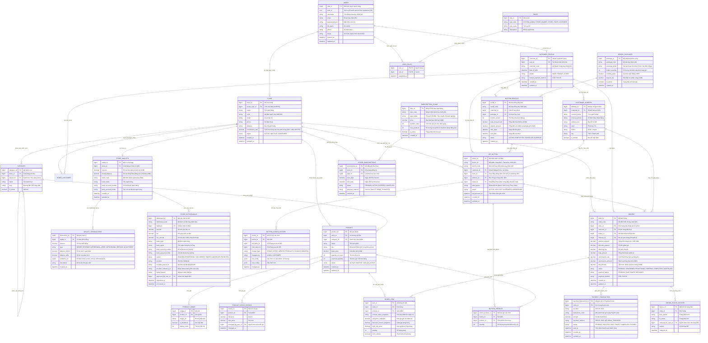

# Sơ Đồ ERD Level 2 — Hệ Thống Đặt Hàng Qua Nút Bấm IoT (Đa Cửa Hàng & Sàn Thương Mại Điện Tử)
**Phiên Bản: V2.2 (Universal Smart Button & Multi-Store Marketplace Ecosystem)**

---

## 1. Phạm vi mô hình (Scope)

Mô hình ERD này mô tả chi tiết các thực thể dữ liệu, thuộc tính, ràng buộc và mối quan hệ cho nền tảng Đặt hàng qua Nút bấm IoT đa cửa hàng hoạt động theo cơ chế **Sàn Thương Mại Điện Tử (Marketplace)**.

### Các nguyên tắc kiến trúc cốt lõi:
- **Sàn TMĐT Đa Cửa hàng (`STORE`)**: Hỗ trợ nhiều Cửa hàng độc lập kinh doanh trên cùng một hệ sinh thái.
- **Tài khoản Khách hàng Toàn cầu (`USERS` & `CUSTOMER_PROFILE`)**: Khách hàng sở hữu 1 tài khoản duy nhất, có thể tương tác và mua sắm tại bất kỳ Cửa hàng nào trên hệ thống.
- **Mô hình Nút Bấm Thông Minh Đa Năng (`IOT_BUTTON`)**:
  - Nút bấm thuộc quyền sở hữu/sử dụng của Khách hàng (`customer_id`).
  - Thiết bị có thể do Khách mua đứt hoặc thuê định kỳ từ Sàn qua gói thuê phần cứng (`BUTTON_RENTALS`).
  - **Linh hoạt chuyển đổi Cửa hàng (Dynamic Store Re-mapping)**: Khách hàng có quyền chuyển đổi Cửa hàng liên kết (`store_id`) của Nút bấm trên Web/App bất kỳ lúc nào để chuyển sang mua hàng từ Cửa hàng khác mà không cần thay đổi phần cứng. Khi chuyển Store, danh mục sản phẩm gắn trên nút (`BUTTON_PRODUCT`) sẽ được làm mới/cấu hình lại tương ứng với Store mới.
- **Mô hình Thu Phí Sàn Phân Tầng (Dual-Fee Marketplace Monetization)**:
  - **Phí thuê bao gian hàng định kỳ (`STORE_SUBSCRIPTIONS`)**: Cửa hàng thanh toán định kỳ theo các gói thuê bao (`SUBSCRIPTION_PLANS`) để duy trì hoạt động và quyền đăng bán trên Sàn.
  - **Phí hoa hồng theo từng đơn hàng (`ORDERS.commission_rate`, `commission_amount`)**: Tự động khấu trừ tỷ lệ % hoa hồng sàn khi đơn hàng giao thành công, phần doanh thu thực nhận (`net_amount`) được tự động kết chuyển vào Ví cửa hàng (`STORE_WALLETS`).
- **Quản lý Dòng tiền & Tự động chi trả PayOS Payout**:
  - Tiền khách thanh toán được thu tập trung vào tài khoản Sàn qua cổng PayOS (`PAYMENT_TRANSACTION`).
  - Khi đơn hàng hoàn thành (`COMPLETED`), hệ thống ghi nhận giao dịch ví (`WALLET_TRANSACTIONS`) và cộng vào số dư khả dụng (`STORE_WALLETS.balance`).
  - Cửa hàng chủ động tạo lệnh rút tiền (`STORE_WITHDRAWALS`), hệ thống thực hiện giải ngân tự động qua PayOS Payout API hoặc qua kiểm duyệt của Quản trị viên Sàn.
- **Snapshot Bất Biến & Audit Trail**:
  - Đơn hàng chụp đầy đủ bản sao giá, chiết khấu, hoa hồng và địa chỉ giao hàng tại thời điểm đặt.
  - Mọi biến động giá gốc được tự động ghi nhận vào `PRODUCT_PRICE_HISTORY`.
  - Mọi thay đổi cấu hình nút bấm được lưu vết tại `BUTTON_CONFIG_HISTORY`.

---

## 2. Sơ Đồ Mermaid ERD


```mermaid
erDiagram
    USERS ||--o| CUSTOMER_PROFILE : "so_huu_ho_so"
    USERS ||--o{ USER_ROLES : "duoc_gan_vai_tro"
    ROLES ||--o{ USER_ROLES : "chua_nguoi_dung"
    USERS ||--o{ STORE : "so_huu_gian_hang"
    
    STORE ||--o{ CATEGORY : "phan_loai_danh_muc"
    STORE ||--o{ PRODUCT : "kinh_doanh_san_pham"
    STORE ||--o{ STORE_CUSTOMER : "quan_ly_khach_hang"
    STORE ||--o{ IOT_BUTTON : "cung_cap_dich_vu_cho"
    STORE ||--o{ ORDERS : "nhan_don_hang"
    STORE ||--o| STORE_WALLETS : "so_huu_vi"
    STORE ||--o{ STORE_SUBSCRIPTIONS : "dang_ky_thue_bao"

    SUBSCRIPTION_PLANS ||--o{ STORE_SUBSCRIPTIONS : "ap_dung_goi"
    
    STORE_WALLETS ||--o{ WALLET_TRANSACTIONS : "ghi_nhan_bien_dong"
    STORE_WALLETS ||--o{ STORE_WITHDRAWALS : "yeu_cau_rut_tien"

    CUSTOMER_PROFILE ||--o{ CUSTOMER_ADDRESS : "so_huu_dia_chi"
    CUSTOMER_PROFILE ||--o{ STORE_CUSTOMER : "lien_ket_store"
    CUSTOMER_PROFILE ||--o{ IOT_BUTTON : "so_huu_thiet_bi"
    CUSTOMER_PROFILE ||--o{ BUTTON_RENTALS : "thue_thiet_bi"
    CUSTOMER_PROFILE ||--o{ ORDERS : "dat_hang"

    RENTAL_PACKAGES ||--o{ BUTTON_RENTALS : "dinh_nghia_goi_thue"
    BUTTON_RENTALS ||--o{ IOT_BUTTON : "cap_phat_thiet_bi"

    IOT_BUTTON ||--o{ BUTTON_PRODUCT : "cau_hinh_san_pham"
    IOT_BUTTON ||--o{ BUTTON_CONFIG_HISTORY : "lich_su_thay_doi"
    IOT_BUTTON ||--o{ ORDERS : "kich_hoat_don_hang"
    
    CUSTOMER_ADDRESS ||--o{ IOT_BUTTON : "dia_chi_mac_dinh"
    CUSTOMER_ADDRESS ||--o{ ORDERS : "dia_chi_giao_hang"

    CATEGORY ||--o{ CATEGORY : "danh_muc_cha_con"
    CATEGORY ||--o{ PRODUCT : "chua_san_pham"
    
    PRODUCT ||--o{ PRODUCT_PRICE_HISTORY : "lich_su_gia"
    PRODUCT ||--o{ PRODUCT_IMAGE : "hinh_anh"
    PRODUCT ||--o{ BUTTON_PRODUCT : "gan_vao_nut"
    PRODUCT ||--o{ ORDER_ITEM : "chi_tiet_don_hang"

    ORDERS ||--o{ ORDER_ITEM : "chua_mat_hang"
    ORDERS ||--o{ ORDER_STATUS_HISTORY : "lich_su_trang_thai"
    ORDERS ||--o{ PAYMENT_TRANSACTION : "giao_dich_thanh_toan"

    USERS {
        bigint user_id PK "Mã định danh người dùng"
        uuid auth_id "Ánh xạ tới auth.users.id của Supabase (UK)"
        string username "Tên đăng nhập duy nhất (UK)"
        string email "Email duy nhất (UK)"
        string password_hash "Mật khẩu mã hóa"
        string full_name "Họ và tên"
        string phone "Số điện thoại"
        string status "ACTIVE, INACTIVE, BLOCKED"
        datetime created_at
        datetime updated_at
    }

    ROLES {
        bigint role_id PK "Mã vai trò"
        string role_code "SYSTEM_ADMIN, STORE_OWNER, STORE_STAFF, CUSTOMER"
        string role_name "Tên vai trò"
        string description "Mô tả quyền hạn"
    }

    USER_ROLES {
        bigint user_id PK,FK "Người dùng"
        bigint role_id PK,FK "Vai trò"
        datetime assigned_at
    }

    STORE {
        bigint store_id PK "Mã cửa hàng"
        bigint owner_user_id FK "Chủ cửa hàng (USERS)"
        string name "Tên gian hàng"
        string code "Mã định danh duy nhất (UK)"
        string email "Email liên hệ"
        string phone "Số điện thoại"
        string address "Địa chỉ gian hàng"
        decimal commission_rate "Tỷ lệ hoa hồng sàn cấu hình riêng (Null = Mặc định 8%)"
        string status "ACTIVE, INACTIVE, SUSPENDED"
        datetime created_at
        datetime updated_at
    }

    SUBSCRIPTION_PLANS {
        bigint plan_id PK "Mã gói thuê bao gian hàng"
        string plan_code "Mã gói định danh duy nhất (UK)"
        string plan_name "Tên gói (Cơ bản, Tiêu chuẩn, Chuyên nghiệp)"
        decimal price "Giá thuê bao định kỳ (VNĐ)"
        int duration_days "Thời hạn gói (30, 90, 365 ngày)"
        int max_products "Số lượng sản phẩm tối đa được phép đăng bán"
        boolean is_active "Trạng thái kích hoạt gói"
        datetime created_at
    }

    STORE_SUBSCRIPTIONS {
        bigint subscription_id PK "Mã đăng ký thuê bao"
        bigint store_id FK "Cửa hàng đăng ký"
        bigint plan_id FK "Gói thuê bao lựa chọn"
        datetime start_date "Ngày bắt đầu hiệu lực"
        datetime end_date "Ngày hết hạn thuê bao"
        string status "PENDING, ACTIVE, EXPIRED, CANCELLED"
        string payment_method "PAYOS, WALLET, BANK_TRANSFER"
        datetime created_at
    }

    STORE_WALLETS {
        bigint wallet_id PK "Mã ví cửa hàng"
        bigint store_id FK "Cửa hàng sở hữu ví (UK)"
        decimal balance "Số dư khả dụng có thể rút (VNĐ)"
        decimal frozen_balance "Số dư đóng băng đang xử lý rút tiền (VNĐ)"
        string bank_code "Mã định danh ngân hàng (BIN)"
        string bank_name "Tên ngân hàng"
        string bank_account_number "Số tài khoản ngân hàng"
        string bank_account_holder "Tên chủ tài khoản ngân hàng"
        datetime created_at
        datetime updated_at
    }

    WALLET_TRANSACTIONS {
        bigint transaction_id PK "Mã giao dịch ví"
        bigint wallet_id FK "Ví nhận biến động"
        decimal amount "Số tiền biến động"
        string type "ORDER_REVENUE, WITHDRAWAL_DEBIT, WITHDRAWAL_REFUND, ADJUSTMENT"
        decimal balance_before "Số dư trước giao dịch"
        decimal balance_after "Số dư sau giao dịch"
        bigint reference_id "ID tham chiếu (order_id hoặc withdrawal_id)"
        string description "Mô tả chi tiết giao dịch"
        datetime created_at
    }

    STORE_WITHDRAWALS {
        bigint withdrawal_id PK "Mã yêu cầu rút tiền"
        string withdrawal_code "Mã lệnh rút tiền duy nhất (UK)"
        bigint wallet_id FK "Ví thực hiện rút tiền"
        decimal amount "Số tiền yêu cầu rút"
        decimal fee "Phí giao dịch rút tiền"
        decimal net_amount "Số tiền thực nhận chuyển khoản"
        string bank_code "Mã BIN ngân hàng"
        string bank_name "Tên ngân hàng thụ hưởng"
        string bank_account_number "Số tài khoản thụ hưởng"
        string bank_account_holder "Chủ tài khoản thụ hưởng"
        string status "PENDING, PROCESSING, SUCCEEDED, FAILED, CANCELLED, REJECTED"
        string provider "PAYOS, MANUAL"
        string provider_payout_id "Mã lệnh trả tiền PayOS API"
        string provider_reference_id "Khóa idempotency đối soát (UK)"
        string failure_reason "Nguyên nhân thất bại"
        bigint approved_by_user_id FK "Admin xét duyệt lệnh"
        datetime requested_at
        datetime processed_at
    }

    CUSTOMER_PROFILE {
        bigint customer_id PK "Mã hồ sơ khách hàng"
        bigint user_id FK "Tài khoản liên kết (UK)"
        string customer_code "Mã khách hàng duy nhất (UK)"
        datetime date_of_birth
        string gender "MALE, FEMALE, OTHER"
        string default_payment_method "COD, PAYOS"
        datetime created_at
        datetime updated_at
    }

    CUSTOMER_ADDRESS {
        bigint address_id PK "Mã địa chỉ giao hàng"
        bigint customer_id FK "Khách hàng sở hữu"
        string receiver_name "Tên người nhận"
        string receiver_phone "Số điện thoại nhận hàng"
        string address_line "Địa chỉ chi tiết"
        string ward "Phường / Xã"
        string district "Quận / Huyện"
        string city "Tỉnh / Thành phố"
        boolean is_default "Địa chỉ mặc định"
    }

    RENTAL_PACKAGES {
        bigint package_id PK "Mã gói thuê phần cứng"
        string package_code "Mã gói duy nhất (UK)"
        string package_name "Tên gói thuê (Cá nhân 1 Nút, Gia đình 3 Nút)"
        int button_quantity "Số lượng nút bấm cấp phát trong gói"
        decimal monthly_price "Giá thuê mỗi tháng (VNĐ)"
        decimal deposit_fee "Tiền đặt cọc phần cứng (VNĐ)"
        boolean is_active "Trạng thái mở bán gói"
        datetime created_at
    }

    BUTTON_RENTALS {
        bigint rental_id PK "Mã hợp đồng thuê nút"
        string rental_code "Mã hợp đồng duy nhất (UK)"
        bigint customer_id FK "Khách hàng thuê"
        bigint package_id FK "Gói thuê lựa chọn"
        int months_rented "Thời hạn thuê (số tháng)"
        decimal total_rent_amount "Tổng tiền thuê đã thu (VNĐ)"
        decimal deposit_amount "Tổng tiền cọc phần cứng đang giữ (VNĐ)"
        datetime start_date "Ngày bắt đầu thuê"
        datetime end_date "Ngày hết hạn thuê"
        string status "ACTIVE, COMPLETED, CANCELLED, OVERDUE"
        datetime created_at
    }

    IOT_BUTTON {
        bigint button_id PK "Mã định danh nút bấm"
        string device_id "Mã phần cứng MAC / Serial duy nhất (UK)"
        string button_code "Mã kích hoạt thân thiện duy nhất (UK)"
        bigint customer_id FK "Khách hàng sở hữu / sử dụng"
        bigint store_id FK "Cửa hàng đang được liên kết (Có thể thay đổi)"
        bigint address_id FK "Địa chỉ giao hàng mặc định"
        bigint rental_id FK "Hợp đồng thuê phần cứng (Nếu thuê từ Sàn)"
        string label_name "Nhãn hiển thị (Nước Suối, Cơm Trưa, Cafe)"
        string status "ACTIVE, INACTIVE, SUSPENDED, UNASSIGNED"
        datetime last_pressed_at "Thời điểm bấm gần nhất"
        datetime created_at
        datetime updated_at
    }

    BUTTON_CONFIG_HISTORY {
        bigint history_id PK "Mã lịch sử cấu hình"
        bigint button_id FK "Nút bấm"
        bigint old_store_id "Cửa hàng trước khi đổi"
        bigint new_store_id "Cửa hàng sau khi đổi"
        string change_type "REMAP_STORE, UPDATE_PRODUCTS, CHANGE_ADDRESS"
        string changed_by "ADMIN, CUSTOMER"
        jsonb old_config "Cấu hình cũ (sản phẩm, số lượng)"
        jsonb new_config "Cấu hình mới"
        datetime changed_at
    }

    CATEGORY {
        bigint category_id PK "Mã danh mục"
        bigint store_id FK "Cửa hàng sở hữu"
        bigint parent_id FK "Danh mục cha (cùng store)"
        string name "Tên danh mục"
        string slug "Đường dẫn SEO duy nhất"
        boolean is_active "Hiển thị"
    }

    PRODUCT {
        bigint product_id PK "Mã sản phẩm"
        bigint store_id FK "Cửa hàng sở hữu"
        bigint category_id FK "Danh mục sản phẩm"
        string name "Tên sản phẩm"
        string sku "Mã quản lý kho (UK trong cùng store)"
        decimal base_price "Giá niêm yết (VNĐ)"
        int quantity_on_hand "Tồn kho thực tế"
        int reserved_quantity "Tồn kho giữ chỗ đơn hàng"
        string status "ACTIVE, INACTIVE, OUT_OF_STOCK"
        datetime created_at
        datetime updated_at
    }

    PRODUCT_PRICE_HISTORY {
        bigint history_id PK "Mã lịch sử giá"
        bigint product_id FK "Sản phẩm"
        decimal old_price "Giá cũ"
        decimal new_price "Giá mới"
        bigint changed_by_user_id FK "Người thực hiện đổi giá"
        datetime changed_at
    }

    PRODUCT_IMAGE {
        bigint image_id PK "Mã ảnh"
        bigint product_id FK "Sản phẩm"
        string image_url "Đường dẫn ảnh"
        boolean is_thumbnail "Ảnh đại diện"
        int display_order "Thứ tự hiển thị"
    }

    BUTTON_PRODUCT {
        bigint button_product_id PK "Mã bản ghi cấu hình"
        bigint button_id FK "Nút bấm"
        bigint product_id FK "Sản phẩm chọn mua"
        int quantity "Số lượng mua khi bấm nút (> 0)"
    }

    ORDERS {
        bigint order_id PK "Mã đơn hàng"
        string order_code "Mã đơn hiển thị duy nhất (UK)"
        bigint store_id FK "Cửa hàng tiếp nhận và xử lý đơn"
        bigint customer_id FK "Khách hàng đặt mua"
        bigint button_id FK "Nút bấm đã kích hoạt đơn"
        bigint address_id FK "Địa chỉ giao hàng (Snapshot)"
        decimal subtotal_amount "Tổng tiền hàng trước chiết khấu"
        decimal discount_amount "Số tiền giảm giá"
        decimal shipping_fee "Phí vận chuyển"
        decimal total_amount "Tổng tiền khách phải trả"
        decimal commission_rate "Tỷ lệ hoa hồng Sàn áp dụng (%)"
        decimal commission_amount "Tiền hoa hồng Sàn thu (VNĐ)"
        decimal net_amount "Tiền thực nhận của Cửa hàng (VNĐ)"
        string status "PENDING, CONFIRMED, PROCESSING, SHIPPING, COMPLETED, CANCELLED"
        string payment_status "PENDING, PAID, FAILED, REFUNDED"
        string payment_method "COD, PAYOS"
        datetime created_at
        datetime updated_at
    }

    ORDER_ITEM {
        bigint item_id PK "Mã dòng chi tiết"
        bigint order_id FK "Đơn hàng"
        bigint product_id FK "Sản phẩm"
        string product_name_snapshot "Tên sản phẩm lúc bấm nút"
        decimal unit_price_snapshot "Đơn giá gốc lúc bấm nút"
        decimal discount_amount_snapshot "Giảm giá dòng hàng"
        decimal final_unit_price "Đơn giá thực tế áp dụng"
        int quantity "Số lượng mua"
        decimal item_subtotal "Thành tiền dòng hàng"
    }

    ORDER_STATUS_HISTORY {
        bigint history_id PK "Mã lịch sử trạng thái"
        bigint order_id FK "Đơn hàng"
        string from_status "Trạng thái trước"
        string to_status "Trạng thái mới"
        bigint changed_by_user_id FK "Người thực hiện đổi trạng thái"
        string reason "Lý do thay đổi"
        datetime changed_at
    }

    PAYMENT_TRANSACTION {
        bigint payment_transaction_id PK "Mã giao dịch cổng thanh toán"
        bigint order_id FK "Đơn hàng thanh toán"
        string provider "PAYOS, COD"
        string transaction_code "Mã orderCode gửi sang PayOS (UK)"
        decimal amount "Số tiền thanh toán"
        string payment_method "PAYOS, COD, QR, BANK_TRANSFER"
        string status "PENDING, SUCCESS, PAID, FAILED, CANCELLED, EXPIRED"
        datetime paid_at "Thời điểm thanh toán thành công"
        datetime created_at
        datetime updated_at
    }
```

---

## 3. Chú Thích Chi Tiết Từng Thực Thể (Entity Notes)

### 3.1 Nhóm Danh Tính, Phân Quyền & Gian Hàng (Core Identity & Merchant)
- **USERS**: Danh tính duy nhất toàn cầu cho tất cả các nhóm đối tượng (Admin, Chủ gian hàng, Nhân viên, Khách hàng). Ánh xạ 1-1 với Supabase Auth thông qua `auth_id`.
- **ROLES & USER_ROLES**: Cơ chế kiểm soát truy cập dựa trên vai trò (RBAC), hỗ trợ gán nhiều vai trò cho một người dùng.
- **STORE**: Gian hàng kinh doanh độc lập. Chứa thuộc tính `commission_rate` (cho phép cấu hình tỷ lệ hoa hồng linh hoạt riêng cho từng Store, nếu NULL sẽ dùng mức mặc định của Sàn là 8%).
- **CUSTOMER_PROFILE**: Hồ sơ khách hàng toàn cầu không gắn cố định vào bất kỳ Store nào.
- **STORE_CUSTOMER**: Bảng ghi nhận mối quan hệ mua sắm/thành viên giữa Store và Khách hàng (`UNIQUE(store_id, customer_id)`).

### 3.2 Nhóm Thu Phí Sàn & Tài Chính Ví Gian Hàng (Marketplace Monetization & Wallet)
- **SUBSCRIPTION_PLANS**: Danh mục gói thuê bao mở gian hàng (Basic, Standard, Pro). Quản lý thời hạn (`duration_days`), giá gói (`price`) và hạn mức đăng bán (`max_products`).
- **STORE_SUBSCRIPTIONS**: Hợp đồng thuê bao gian hàng của Store với Sàn. Trạng thái `ACTIVE` cho phép Store kích hoạt quyền kinh doanh và tiếp nhận đơn hàng.
- **STORE_WALLETS**: Ví điện tử nội bộ của Store. Quản lý `balance` (số dư khả dụng có thể rút) và `frozen_balance` (số dư tạm khóa khi đang chờ ngân hàng xử lý lệnh PayOS Payout).
- **WALLET_TRANSACTIONS**: Sổ cái ghi nhận mọi biến động tài chính của Ví:
  - `ORDER_REVENUE`: Tiền thực nhận từ đơn hàng hoàn tất (`+net_amount`).
  - `WITHDRAWAL_DEBIT`: Trừ số dư khi lệnh rút tiền chuyển khoản thành công (`-amount`).
  - `WITHDRAWAL_REFUND`: Hoàn lại số dư nếu lệnh chi tiền PayOS thất bại (`+amount`).
- **STORE_WITHDRAWALS**: Quản lý quy trình rút tiền và chi trả tự động thông qua PayOS Payout. Sử dụng `provider_reference_id` làm khóa Idempotency chống chi trùng lặp.
- **PAYMENT_TRANSACTION**: Quản lý cổng thu tiền khách hàng (PayOS Payment Link / Webhook và COD).

### 3.3 Nhóm Thiết Bị Thông Minh & Thuê Phần Cứng (IoT Hardware & Rental)
- **RENTAL_PACKAGES**: Bảng định nghĩa các gói thuê nút bấm dành cho Khách hàng (Giá thuê theo tháng, tiền đặt cọc phần cứng).
- **BUTTON_RENTALS**: Quản lý hợp đồng thuê phần cứng của khách hàng, theo dõi tiền cọc (`deposit_amount`), hạn thuê và trạng thái hợp đồng.
- **IOT_BUTTON (Universal Smart Button)**:
  - Thuộc quyền sở hữu của Khách hàng (`customer_id`).
  - **Dynamic Store Re-mapping**: Nút liên kết với một `store_id` để biết sẽ gửi tín hiệu đặt hàng tới cửa hàng nào. Khách hàng có thể thay đổi `store_id` bất kỳ lúc nào trên ứng dụng.
  - Trường `rental_id`: Liên kết tới hợp đồng thuê nếu nút là thiết bị do Sàn cấp phát theo dạng thuê.
- **BUTTON_CONFIG_HISTORY**: Bảng kiểm toán ghi lại toàn bộ lịch sử mỗi khi khách hàng đổi Cửa hàng liên kết hoặc thay đổi danh sách sản phẩm cấu hình trên nút.
- **BUTTON_PRODUCT**: Cấu hình các món hàng sẽ được tạo thành đơn khi khách bấm nút (`quantity > 0`).

### 3.4 Nhóm Sản Phẩm, Kho Bãi & Đơn Hàng (Catalog, Inventory & Orders)
- **CATEGORY & PRODUCT**: Danh mục và sản phẩm thuộc quyền quản lý riêng biệt của từng `store_id`.
- **PRODUCT_PRICE_HISTORY**: Ghi log tự động biến động giá niêm yết thông qua Database Trigger.
- **ORDERS**:
  - Đơn hàng được kích hoạt từ nút bấm IoT vật lý.
  - Lưu trữ Snapshot toán học tài chính:
    - `total_amount = subtotal_amount - discount_amount + shipping_fee`
    - `commission_amount = ROUND(total_amount * commission_rate / 100, 2)`
    - `net_amount = total_amount - commission_amount`
- **ORDER_ITEM**: Bản sao bất biến đầy đủ về giá gốc, giảm giá, số lượng và thành tiền tại thời điểm tạo đơn.

---

## 4. Các Ràng Buộc & Quy Tắc Trọng Yếu (Critical Business Rules & Triggers)

### 4.1 Quy tắc Chuyển Đổi Store Trên Nút Bấm (Dynamic Store Re-mapping)
- Nút bấm KHÔNG bị khóa cứng vào một Store duy nhất. Khách hàng được quyền cập nhật `IOT_BUTTON.store_id`.
- **Trigger `trg_iot_button_store_remap`**: Khi `store_id` của nút bấm bị thay đổi:
  1. Tự động xóa hoặc vô hiệu hóa toàn bộ cấu hình sản phẩm cũ trong `BUTTON_PRODUCT` tương ứng với `button_id` đó.
  2. Ghi bản ghi kiểm toán vào `BUTTON_CONFIG_HISTORY` với `change_type = 'REMAP_STORE'`, lưu lại `old_store_id` và `new_store_id`.
  3. Yêu cầu Khách hàng thực hiện cấu hình lại danh sách sản phẩm thuộc Store mới trước khi nút có thể tạo đơn hàng hợp lệ.

### 4.2 Đồng Nhất Cửa Hàng Giữa Nút Và Sản Phẩm
- Mọi sản phẩm cấu hình trong `BUTTON_PRODUCT` bắt buộc phải có `product.store_id = iot_button.store_id`.
- Khi bấm nút tạo đơn, hệ thống kiểm tra toàn bộ sản phẩm trên nút có đang ở trạng thái `ACTIVE` và còn tồn kho khả dụng (`quantity_on_hand - reserved_quantity >= quantity`) tại Store đó hay không.

### 4.3 Quy Tắc Tính Phí Sàn & Phân Bổ Doanh Thu (Dual-Fee Processing)
1. **Toàn vẹn toán học Đơn hàng & Hoa hồng**:
   $$\text{total\_amount} = \text{subtotal\_amount} - \text{discount\_amount} + \text{shipping\_fee}$$
   $$\text{commission\_amount} = \text{ROUND}\left(\text{total\_amount} \times \frac{\text{commission\_rate}}{100}, 2\right)$$
   $$\text{net\_amount} = \text{total\_amount} - \text{commission\_amount}$$
   $$\text{net\_amount} \ge 0$$
2. **Kích hoạt kết chuyển ví**:
   - Khi đơn hàng chuyển trạng thái sang `COMPLETED`:
     - Tự động cộng số tiền `net_amount` vào `STORE_WALLETS.balance`.
     - Tự động tạo bản ghi trong `WALLET_TRANSACTIONS` với `type = 'ORDER_REVENUE'`, ghi nhận `balance_before` và `balance_after`.
3. **Quy tắc Rút tiền (PayOS Payout)**:
   - Khi Store tạo yêu cầu rút tiền:
     - Kiểm tra `amount <= STORE_WALLETS.balance`.
     - Trừ `amount` từ `balance` và cộng vào `frozen_balance`.
   - Nếu lệnh rút tiền `SUCCEEDED`:
     - Trừ `amount` từ `frozen_balance`.
     - Ghi nhận `WALLET_TRANSACTIONS` với `type = 'WITHDRAWAL_DEBIT'`.
   - Nếu lệnh rút tiền bị `FAILED` hoặc `REJECTED`:
     - Trừ `amount` từ `frozen_balance` và hoàn trả lại `balance`.
     - Ghi nhận `WALLET_TRANSACTIONS` với `type = 'WITHDRAWAL_REFUND'`.

### 4.4 Quy tắc Giữ Chỗ & Trừ Kho Bãi (Inventory Safety)
$$\text{reserved\_quantity} \le \text{quantity\_on\_hand}$$
$$\text{quantity\_on\_hand} \ge 0, \quad \text{reserved\_quantity} \ge 0$$
- Khi đơn hàng tạo mới (`PENDING`): Tăng `reserved_quantity` bằng số lượng mua.
- Khi đơn hàng hoàn thành (`COMPLETED`): Trừ cả `quantity_on_hand` và `reserved_quantity`.
- Khi đơn hàng bị hủy (`CANCELLED`): Giảm `reserved_quantity`, giữ nguyên `quantity_on_hand`.

---

## 5. Danh Mục Chỉ Mục Tối Ưu Hóa Hiệu Năng (Recommended Indexes)

```sql
-- Tìm kiếm nhanh thiết bị IoT theo mã phần cứng và mã kích hoạt
CREATE UNIQUE INDEX idx_iot_button_device_id ON iot_button (device_id);
CREATE UNIQUE INDEX idx_iot_button_code ON iot_button (button_code);
CREATE INDEX idx_iot_button_customer ON iot_button (customer_id);
CREATE INDEX idx_iot_button_store ON iot_button (store_id);

-- Tối ưu hóa truy vấn đơn hàng theo Store và Khách hàng
CREATE INDEX idx_orders_store_status ON orders (store_id, status);
CREATE INDEX idx_orders_customer ON orders (customer_id, created_at DESC);
CREATE INDEX idx_orders_created_at ON orders (created_at DESC);

-- Đối soát giao dịch ví và lệnh rút tiền
CREATE INDEX idx_wallet_tx_wallet_created ON wallet_transactions (wallet_id, created_at DESC);
CREATE INDEX idx_withdrawals_wallet_status ON store_withdrawals (wallet_id, status);
CREATE UNIQUE INDEX idx_withdrawals_ref_id ON store_withdrawals (provider_reference_id);

-- Cổng thanh toán và đối soát PayOS
CREATE UNIQUE INDEX idx_payment_tx_code ON payment_transaction (transaction_code);
CREATE INDEX idx_payment_tx_order ON payment_transaction (order_id);
```
