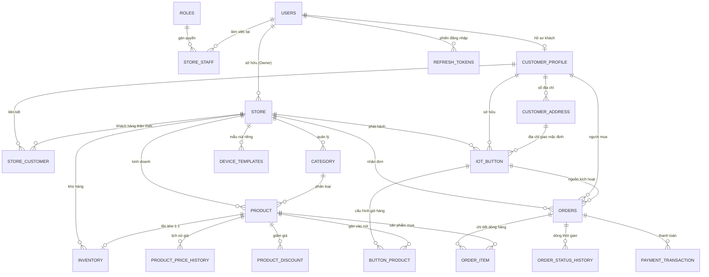
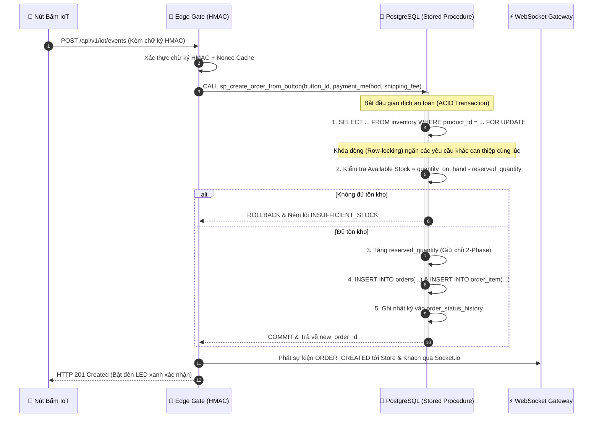

# 🏛️ Smart Order Button Platform — Database Architecture & Schema Specification
> **Hệ Thống Cơ Sở Dữ Liệu Nền Tảng Nút Bấm Đặt Hàng Thông Minh Đa Cửa Hàng (BRD V2.1)**  
> **Mục tiêu tài liệu**: Cung cấp bức tranh toàn cảnh, chi tiết cấu trúc bảng, quan hệ thực thể, ràng buộc bảo mật và cơ chế chống xung đột đồng thời để **AI Agents, System Architects và Developers** dễ dàng rà soát, kiểm toán và mở rộng hệ thống.

---

## 📑 Mục Lục
1. [Bản Thiết Kế Kiến Trúc & Triết Lý Đa Khách Thuê (Multi-Store SaaS)](#1-bản-thiết-kế-kiến-trúc--triết-lý-đa-khách-thuê-multi-store-saas)
2. [Sơ Đồ Quan Hệ Thực Thể Toàn Diện (Mermaid ERD)](#2-sơ-đồ-quan-hệ-thực-thể-toàn-diện-mermaid-erd)
3. [Từ Điển Dữ Liệu Chi Tiết Theo Miền Nghiệp Vụ (Data Dictionary)](#3-từ-điển-dữ-liệu-chi-tiết-theo-miền-nghiệp-vụ-data-dictionary)
   - [3.1 Miền Định Danh, Xác Thực & Phân Quyền (IAM & RBAC Domain)](#31-miền-định-danh-xác-thực--phân-quyền-iam--rbac-domain)
   - [3.2 Miền Cửa Hàng, Danh Mục & Tồn Kho (Catalog & Inventory Domain)](#32-miền-cửa-hàng-danh-mục--tồn-kho-catalog--inventory-domain)
   - [3.3 Miền Thiết Bị IoT & Nút Bấm Thông Minh (Hardware & IoT Domain)](#33-miền-thiết-bị-iot--nút-bấm-thông-minh-hardware--iot-domain)
   - [3.4 Miền Đơn Hàng & Giao Dịch Thanh Toán (Orders & Fulfillment Domain)](#34-miền-đơn-hàng--giao-dịch-thanh-toán-orders--fulfillment-domain)
4. [Các Quy Tắc Bất Biến & Cơ Chế Bảo Mật Tầng Dữ Liệu (Security Invariants)](#4-các-quy-tắc-bất-biến--cơ-chế-bảo-mật-tầng-dữ-liệu-security-invariants)
5. [Quy Trình Xử Lý Đơn Hàng Đột Biến Bằng Stored Procedure & Khóa Dòng](#5-quy-trình-xử-lý-đơn-hàng-đột-biến-bằng-stored-procedure--khóa-dòng)
6. [Cẩm Nang Truy Vấn & Kiểm Toán Dành Cho AI (AI Reviewer Checklist)](#6-cẩm-nang-truy-vấn--kiểm-toán-dành-cho-ai-ai-reviewer-checklist)

---

## 1. Bản Thiết Kế Kiến Trúc & Triết Lý Đa Khách Thuê (Multi-Store SaaS)

Cơ sở dữ liệu được xây dựng trên nền tảng **PostgreSQL (Supabase Engine)**, tuân thủ nghiêm ngặt chuẩn kiến trúc **BRD V2.1**:

```
                       ┌──────────────────────────────┐
                       │       SUPER ADMIN SAAS       │
                       │ (Quản trị toàn bộ nền tảng)  │
                       └──────────────┬───────────────┘
                                      │
            ┌─────────────────────────┴─────────────────────────┐
            ▼                                                   ▼
┌──────────────────────────┐                         ┌──────────────────────────┐
│         STORE A          │                         │         STORE B          │
│ - Nhân sự (StoreStaff)   │                         │ - Nhân sự (StoreStaff)   │
│ - Danh mục & Sản phẩm    │                         │ - Danh mục & Sản phẩm    │
│ - Tồn kho (Inventory)    │                         │ - Tồn kho (Inventory)    │
│ - Nút bấm (IoTButton)    │                         │ - Nút bấm (IoTButton)    │
└───────────┬──────────────┘                         └───────────┬──────────────┘
            │                                                   │
            └─────────────────────────┬─────────────────────────┘
                                      │
                       ┌──────────────▼───────────────┐
                       │   GLOBAL CUSTOMER PROFILE    │
                       │ (Khách hàng độc lập, dùng 1  │
                       │  tài khoản mua nhiều Store)  │
                       └──────────────────────────────┘
```

### 3 Nguyên Tắc Cốt Lõi:
1. **Cô lập dữ liệu Cửa hàng (Store Partitioning & BOLA Defense)**: Mọi tài nguyên gồm `product`, `category`, `inventory`, `orders`, `iot_button` đều có khóa ngoại `store_id`. Nhân sự cửa hàng này tuyệt đối không thể truy vấn hoặc can thiệp dữ liệu cửa hàng khác.
2. **Khách hàng toàn cầu (Global Customer Decoupling)**: Khách hàng chỉ cần 1 tài khoản `users` và 1 hồ sơ `customer_profile`. Khách hàng có thể kết nối với nhiều cửa hàng thông qua bảng liên kết `store_customer` và sở hữu các nút bấm thuộc các cửa hàng khác nhau.
3. **Tính toàn vẹn phần cứng (Hardware-Store Invariant)**: Mỗi nút bấm `iot_button` chỉ được liên kết với một `store_id` duy nhất. Mọi sản phẩm gắn vào nút đó (`button_product`) bắt buộc phải thuộc cùng `store_id` đó (chống cross-store ordering).

---

## 2. Sơ Đồ Quan Hệ Thực Thể Toàn Diện (Mermaid ERD)



---

## 3. Từ Điển Dữ Liệu Chi Tiết Theo Miền Nghiệp Vụ (Data Dictionary)

---

### 3.1 Miền Định Danh, Xác Thực & Phân Quyền (IAM & RBAC Domain)

#### Bảng `roles`
*Định nghĩa các vai trò hệ thống và vai trò nhân sự cửa hàng.*
| Cột | Kiểu Dữ Liệu | Ràng buộc | Ý nghĩa / Ghi chú |
| :--- | :--- | :--- | :--- |
| `role_id` | `BIGSERIAL` | `PK` | Khóa chính tự tăng |
| `role_code` | `VARCHAR(50)` | `NOT NULL, UNIQUE` | Mã vai trò: `SYSTEM_ADMIN`, `STORE_OWNER`, `STAFF_ORDER`, `STAFF_INVENTORY`, `STAFF_BUTTON`, `CUSTOMER` |
| `role_name` | `VARCHAR(100)` | `NOT NULL` | Tên hiển thị của vai trò |
| `description` | `TEXT` | `NULL` | Mô tả phạm vi quyền hạn |

#### Bảng `users`
*Tài khoản trung tâm dùng để xác thực trên toàn hệ thống.*
| Cột | Kiểu Dữ Liệu | Ràng buộc | Ý nghĩa / Ghi chú |
| :--- | :--- | :--- | :--- |
| `user_id` | `BIGSERIAL` | `PK` | Khóa chính |
| `auth_id` | `UUID` | `UNIQUE, NULL` | Đồng bộ UUID với Supabase Auth nếu cần |
| `username` | `VARCHAR(100)` | `NOT NULL, UNIQUE` | Tên đăng nhập |
| `email` | `VARCHAR(255)` | `NOT NULL, UNIQUE` | Email đăng nhập |
| `password_hash` | `VARCHAR(255)` | `NOT NULL` | Mật khẩu băm (Bcrypt 12 rounds hoặc Argon2) |
| `full_name` | `VARCHAR(150)` | `NOT NULL` | Họ và tên |
| `phone` | `VARCHAR(20)` | `NULL` | Số điện thoại |
| `status` | `VARCHAR(20)` | `DEFAULT 'ACTIVE'` | Trạng thái: `ACTIVE`, `INACTIVE`, `LOCKED` |
| `password_reset_token` | `VARCHAR(255)` | `NULL` | **Mã băm SHA-256** của token đặt lại mật khẩu |
| `password_reset_expires_at` | `TIMESTAMPTZ` | `NULL` | Thời điểm hết hạn link quên mật khẩu (15 phút) |
| `email_verification_token` | `VARCHAR(255)` | `NULL` | **Mã băm SHA-256** của token kích hoạt email |
| `email_verification_expires_at` | `TIMESTAMPTZ` | `NULL` | Thời điểm hết hạn kích hoạt email (24 giờ) |
| `created_at` | `TIMESTAMPTZ` | `DEFAULT NOW()` | Thời điểm tạo |
| `updated_at` | `TIMESTAMPTZ` | `DEFAULT NOW()` | Thời điểm cập nhật |

#### Bảng `refresh_tokens`
*Lưu trữ và xoay vòng Refresh Token an toàn chống đánh cắp phiên.*
| Cột | Kiểu Dữ Liệu | Ràng buộc | Ý nghĩa / Ghi chú |
| :--- | :--- | :--- | :--- |
| `id` | `BIGSERIAL` | `PK` | Khóa chính |
| `user_id` | `BIGINT` | `FK -> users(user_id) ON DELETE CASCADE` | Người dùng sở hữu phiên |
| `token_hash` | `VARCHAR(255)` | `NOT NULL, UNIQUE` | **Mã băm SHA-256** duy nhất của refresh token |
| `expires_at` | `TIMESTAMPTZ` | `NOT NULL` | Thời điểm token hết hạn (7 ngày) |
| `is_revoked` | `BOOLEAN` | `DEFAULT FALSE` | `TRUE` khi đã thu hồi (logout hoặc đã đổi token mới) |
| `created_at` | `TIMESTAMPTZ` | `DEFAULT NOW()` | Thời điểm cấp |

#### Bảng `store_staff`
*Phân công nhân sự vào từng cửa hàng kèm theo vai trò chi tiết.*
| Cột | Kiểu Dữ Liệu | Ràng buộc | Ý nghĩa / Ghi chú |
| :--- | :--- | :--- | :--- |
| `store_staff_id` | `BIGSERIAL` | `PK` | Khóa chính |
| `store_id` | `BIGINT` | `FK -> store(store_id) ON DELETE RESTRICT` | Cửa hàng nhân viên công tác |
| `user_id` | `BIGINT` | `FK -> users(user_id) ON DELETE RESTRICT` | Người dùng được chỉ định |
| `role_id` | `BIGINT` | `FK -> roles(role_id) ON DELETE RESTRICT` | Vai trò trong cửa hàng |
| `status` | `VARCHAR(20)` | `DEFAULT 'ACTIVE'` | Trạng thái: `ACTIVE`, `INACTIVE` |
| `joined_at` | `TIMESTAMPTZ` | `DEFAULT NOW()` | Ngày bắt đầu làm việc |

#### Bảng `customer_profile` & `customer_address`
*Hồ sơ người tiêu dùng và sổ địa chỉ phục vụ giao hàng nút bấm.*
- `customer_profile`: Chứa `customer_id` (PK), liên kết 1-1 với `users(user_id)`.
- `customer_address`: Chứa `address_id` (PK), `customer_id` (FK), `recipient_name`, `phone`, `address_detail`, `ward`, `district`, `province`, `is_default`.

#### Bảng `store_customer`
*Ghi nhận liên kết thân thiết giữa Khách hàng và Cửa hàng.*
- Ràng buộc duy nhất `UQ(store_id, customer_id)`. Tự động tạo khi khách hàng ghép nối nút bấm đầu tiên của cửa hàng đó.

---

### 3.2 Miền Cửa Hàng, Danh Mục & Tồn Kho (Catalog & Inventory Domain)

#### Bảng `store`
*Thực thể Cửa hàng độc lập trong mô hình SaaS Đa khách thuê.*
| Cột | Kiểu Dữ Liệu | Ràng buộc | Ý nghĩa / Ghi chú |
| :--- | :--- | :--- | :--- |
| `store_id` | `BIGSERIAL` | `PK` | Khóa chính Cửa hàng |
| `owner_user_id` | `BIGINT` | `FK -> users(user_id) ON DELETE RESTRICT` | Chủ cửa hàng (Store Owner) |
| `name` | `VARCHAR(255)` | `NOT NULL` | Tên cửa hàng |
| `code` | `VARCHAR(50)` | `NOT NULL, UNIQUE` | Mã cửa hàng (VD: `STORE-LAVIE-01`) |
| `phone` | `VARCHAR(20)` | `NOT NULL` | Số điện thoại liên hệ |
| `address` | `TEXT` | `NOT NULL` | Địa chỉ cửa hàng / kho xuất hàng |
| `status` | `VARCHAR(20)` | `DEFAULT 'ACTIVE'` | Trạng thái: `ACTIVE`, `INACTIVE`, `SUSPENDED` |

#### Bảng `product` & `category`
- `category`: Phân loại hàng hóa theo cây phân cấp (`parent_category_id`). Đảm bảo `UQ(store_id, category_id)`.
- `product`: Chứa thông tin sản phẩm, gồm `product_id` (PK), `store_id` (FK), `product_code`, `product_name`, `base_price` (Decimal 15,2), `status`. Đảm bảo `UQ(store_id, product_code)`.

#### Bảng `inventory`
*Quản lý kho hàng với cơ chế Giữ chỗ 2-Phase (Two-Phase Inventory Reservation).*
| Cột | Kiểu Dữ Liệu | Ràng buộc | Ý nghĩa / Ghi chú |
| :--- | :--- | :--- | :--- |
| `inventory_id` | `BIGSERIAL` | `PK` | Khóa chính kho hàng |
| `store_id` | `BIGINT` | `FK -> store(store_id) ON DELETE RESTRICT` | Cửa hàng sở hữu |
| `productId` | `BIGINT` | `FK -> product(product_id) ON DELETE CASCADE, UNIQUE` | Sản phẩm tương ứng (quan hệ 1-1) |
| `quantity_on_hand` | `INT` | `DEFAULT 0, CHECK >= 0` | Số lượng tồn kho thực tế có trong kho |
| `reserved_quantity` | `INT` | `DEFAULT 0, CHECK >= 0` | Số lượng đang được giữ chỗ cho các đơn hàng mới tạo |
| `min_stock_alert` | `INT` | `DEFAULT 5` | Ngưỡng báo động sắp hết hàng |

> **Công thức tồn khả dụng**: `Available Stock = quantity_on_hand - reserved_quantity`. Khách chỉ được đặt nếu `Available Stock >= Ordered Quantity`.

---

### 3.3 Miền Thiết Bị IoT & Nút Bấm Thông Minh (Hardware & IoT Domain)

#### Bảng `iot_button`
*Đại diện cho phần cứng nút bấm thông minh triển khai tại nhà khách hàng.*
| Cột | Kiểu Dữ Liệu | Ràng buộc | Ý nghĩa / Ghi chú |
| :--- | :--- | :--- | :--- |
| `button_id` | `BIGSERIAL` | `PK` | Khóa chính nút bấm |
| `store_id` | `BIGINT` | `FK -> store(store_id)` | Cửa hàng chịu trách nhiệm giao hàng |
| `customer_id` | `BIGINT` | `FK -> customer_profile(customer_id)` | Khách hàng sở hữu nút |
| `address_id` | `BIGINT` | `FK -> customer_address(address_id)` | Địa chỉ giao hàng mặc định của nút |
| `device_id` | `VARCHAR(100)` | `NOT NULL, UNIQUE` | ID phần cứng nhúng trong chip ESP32 (VD: `BTN-8829-WTR`) |
| `button_code` | `VARCHAR(100)` | `NOT NULL, UNIQUE` | Mã vạch / QR Code in trên thân nút |
| `device_secret` | `VARCHAR(255)` | `NOT NULL` | Khóa bí mật dùng ký HMAC-SHA256 mỗi lần bấm nút |
| `status` | `VARCHAR(20)` | `DEFAULT 'ACTIVE'` | Trạng thái: `ACTIVE`, `INACTIVE`, `LOCKED`, `UNASSIGNED` |

#### Bảng `button_product`
*Giỏ hàng mặc định gắn liền với nút bấm (1 nút có thể đặt 1 hoặc nhiều sản phẩm).*
- Ràng buộc: `button_id` (FK), `product_id` (FK), `quantity` (INT, default 1).
- Đảm bảo tính toàn vẹn: Sản phẩm gán trên nút bắt buộc phải cùng `store_id` với nút đó.

#### Bảng `device_templates`
*Mẫu nút bấm có sẵn giúp khởi tạo và nhân bản nút bấm nhanh chóng.*
- Chứa `template_id` (PK), `code` (UNIQUE), `name`, `category`, `store_id` (NULL nếu là template toàn sàn), `single_press_action` (mặc định: `CREATE_ORDER`), `double_press_action` (mặc định: `CANCEL_ORDER`), `cancel_window_seconds` (mặc định: 60s).

---

### 3.4 Miền Đơn Hàng & Giao Dịch Thanh Toán (Orders & Fulfillment Domain)

#### Bảng `orders`
*Đơn hàng tự động phát sinh từ sự kiện bấm nút hoặc đặt nhanh.*
| Cột | Kiểu Dữ Liệu | Ràng buộc | Ý nghĩa / Ghi chú |
| :--- | :--- | :--- | :--- |
| `order_id` | `BIGSERIAL` | `PK` | Khóa chính đơn hàng |
| `order_code` | `VARCHAR(50)` | `NOT NULL, UNIQUE` | Mã đơn hàng (VD: `ORD-20260925-A1B2C3`) |
| `store_id` | `BIGINT` | `FK -> store(store_id)` | Cửa hàng tiếp nhận và xử lý đơn |
| `customer_id` | `BIGINT` | `FK -> customer_profile(customer_id)` | Khách hàng đặt mua |
| `button_id` | `BIGINT` | `FK -> iot_button(button_id)` | Nút bấm vật lý đã gửi tín hiệu |
| `order_status` | `VARCHAR(30)` | `DEFAULT 'PENDING'` | Trạng thái: `PENDING`, `CONFIRMED`, `SHIPPING`, `COMPLETED`, `CANCELLED` |
| `payment_status` | `VARCHAR(30)` | `DEFAULT 'UNPAID'` | Thanh toán: `UNPAID`, `PAID`, `REFUNDED` |
| `payment_method` | `VARCHAR(30)` | `DEFAULT 'COD'` | Phương thức: `COD`, `VNPAY`, `MOMO`, `CREDIT_CARD` |
| `subtotal_amount`| `DECIMAL(15, 2)`| `NOT NULL` | Tổng tiền hàng |
| `shipping_fee` | `DECIMAL(15, 2)`| `DEFAULT 0` | Phí vận chuyển |
| `total_amount` | `DECIMAL(15, 2)`| `NOT NULL` | Tổng tiền thanh toán cuối cùng |
| `order_date` | `TIMESTAMPTZ` | `DEFAULT NOW()` | Thời điểm bấm nút phát sinh đơn |
| `completed_at` | `TIMESTAMPTZ` | `NULL` | Thời điểm hoàn tất giao hàng |

#### Bảng `order_item`
*Ảnh chụp nguyên vẹn (Snapshot) giá và chiết khấu tại thời điểm bấm nút.*
- Lưu: `order_id`, `product_id`, `product_name_snapshot`, `unit_price_snapshot`, `discount_amount_snapshot`, `final_unit_price`, `quantity`, `item_subtotal`.
- **Nguyên tắc bất biến**: Dù giá sản phẩm trong bảng `product` sau này có tăng/giảm thì đơn hàng trong quá khứ vẫn giữ nguyên giá trị snapshot đã mua.

---

## 4. Các Quy Tắc Bất Biến & Cơ Chế Bảo Mật Tầng Dữ Liệu (Security Invariants)

| Quy tắc | Rủi ro nếu vi phạm | Giải pháp bảo mật triển khai |
| :--- | :--- | :--- |
| **1. Miễn nhiễm SQLi** | Bị đánh cắp toàn bộ DB | 100% truy vấn qua Prepared Statements (`$1, $2`), tuyệt đối không ghép chuỗi SQL. |
| **2. BOLA / IDOR Defense** | Cửa hàng A xem trộm dữ liệu Cửa hàng B | Mọi truy vấn Service luôn ràng buộc `WHERE store_id = req.user.storeId`. |
| **3. Không lưu Raw Token** | Rò rỉ DB làm mất tài khoản | Refresh Token, Forgot Password Token, Email Verification Token chỉ lưu **SHA-256 Hash**. |
| **4. Snapshot Giá Bán** | Đổi giá sản phẩm làm sai lệch doanh thu quá khứ | Dòng hàng `order_item` lưu giá snapshot độc lập tại thời điểm tạo đơn. |
| **5. Chống Race Condition** | Bấm nút liên tục làm âm tồn kho kho hàng | Khóa dòng `SELECT FOR UPDATE` trên bảng `inventory` khi trừ tồn kho. |
| **6. Chống Replay Attack** | Bắt gói tin bấm nút rồi gửi lại liên tục | Sử dụng `x-nonce` kết hợp kiểm tra độ lệch thời gian `x-timestamp` <= 300s. |

---

## 5. Quy Trình Xử Lý Đơn Hàng Đột Biến Bằng Stored Procedure & Khóa Dòng

Để đảm bảo tốc độ phản hồi < 50ms khi nút IoT gửi tín hiệu và **chống hoàn toàn hiện tượng bán vượt tồn kho (Overselling)**, hệ thống sử dụng Stored Procedure `sp_create_order_from_button`:



---

## 6. Cẩm Nang Truy Vấn & Kiểm Toán Dành Cho AI (AI Reviewer Checklist)

Khi một AI Assistant nhận nhiệm vụ kiểm tra hoặc phát triển tính năng mới trên cơ sở dữ liệu này, hãy kiểm tra lần lượt 6 câu hỏi sau:

1. **Phân quyền Đa khách thuê**: Query của bạn có chứa `WHERE store_id = $X` không? Đã kiểm tra trường hợp `store_id IS NULL` chưa?
2. **Khóa Ngoại & Ràng buộc**: Khi thêm bảng mới, đã thêm `ON DELETE CASCADE` cho bảng con phụ thuộc hoặc `ON DELETE RESTRICT` cho thực thể gốc chưa?
3. **An toàn Kiểu Dữ Liệu**: Các ID có dùng `BIGINT` / `BigInt` (trong TypeScript) và các cột tiền tệ có dùng `DECIMAL(15, 2)` không? (Tuyệt đối không dùng `FLOAT` để tính tiền).
4. **Mã Băm Bảo Mật**: Nếu sinh mã xác thực ngẫu nhiên, bạn đã băm bằng `crypto.createHash('sha256')` trước khi lưu vào bảng chưa?
5. **Giao Dịch Đa Bảng**: Các thao tác ghi từ 2 bảng trở lên (ví dụ: tạo đơn + trừ kho) đã được bọc trong `db.$transaction` hoặc Stored Procedure chưa?
6. **Đồng Bộ Schema**: Sau khi sửa database, đã cập nhật tương ứng vào [prisma/schema.prisma](file:///f:/Learning/SEM9-FPTu/backend/prisma/schema.prisma) và chạy `npx prisma generate` chưa?
